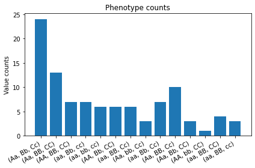
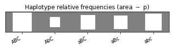

# HaploPy – Haplotype estimation and phasing in Python

This package contains tools for estimating haplotype (or allele list) frequencies in a population using measurements of unphased genotype data, that is, phenotypes.

## Introduction

In layman terms, a phenotype is defined as an observation of two-allele sets
over multiple gene loci:

``` text
    Aa ––––––– Bb ––––––– Cc
    |          |          |
  locus 1    locus 2    locus 3
```

Note that the above datum doesn't reveal what are the exact haplotype (allele
sequence) pair behind the phenotype. Possible parent haplotype pairs that could
result into the above phenotype are given by

``` text
(ABC, abc), (aBC, Abc), (AbC, aBc), (abC, ABc)
```

In other words, the mapping that maps a haplotype pair to a phenotype is defined
by the example

``` text
(Abc, aBC) => (Aa, Bb, Cc)
```

and so on. Note that each item in the phenotype is a set of two alleles where the
order doesn't matter. 

**Problem:** Suppose that we have a set of phenotype observations from a large
population of N individuals. For each individual phenotype we would like to
estimate what are the most probable haplotype pair that resulted into the
phenotype. The main ingredient of solution is the estimation of individual
haplotype frequencies in the population 

## Installation

The package is found in PyPi.

``` text
pip install haplopy
```

## Examples

### Estimate haplotype frequencies

Simulate dataset using a prescribed haplotype probabilities and 
a multinomial distribution model.

``` python
import haplopy as hp


p_haplotypes = {
    ("A", "B", "C"): 0.34,
    ("a", "B", "c"): 0.20,
    ("a", "B", "C"): 0.13,
    ("a", "b", "c"): 0.23,
    ("A", "b", "C"): 0.10
}

phenotypes = hp.multinomial.Model(p_haplotypes).random(100)

fig = hp.plot.plot_haplotypes(p_haplotypes)
fig = hp.plot.plot_phenotypes(phenotypes)
```




Pretend that we don't know the underlying haplotype distribution and let's try to estimate it.

``` python
model = hp.multinomial.Model().fit(phenotypes)
fig = hp.plot.plot_haplotypes(
    model.p_haplotypes,
    thres=1.0e-6  # Hide probabilities smaller than this
)
```



## To-be-added features

- **TODO** Phasing of unphased phenotypes given a haplotype frequency model
- **TODO** Imputation of missing locus measurements
