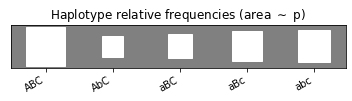

# HaploPy – Haplotype estimation and phasing in Python

This package contains tools for estimating haplotype (or allele list) frequencies in a population using measurements of unphased genotype data, that is, phenotypes.

## Introduction

In layman terms, a phenotype is defined as an observation of two-allele sets
over multiple gene loci:

``` text
    Aa ––––––– Bb ––––––– Cc
    |          |          |
  locus 1    locus 2    locus 3
```

Note that the above datum doesn't reveal what are the exact haplotype (allele
sequence) pair behind the phenotype. Possible parent haplotype pairs that could
result into the above phenotype are given by

``` text
(ABC, abc), (aBC, Abc), (AbC, aBc), (abC, ABc)
```

In other words, the mapping that maps a haplotype pair to a phenotype is defined
by the example

``` text
(Abc, aBC) => (Aa, Bb, Cc)
```

and so on. Note that each item in the phenotype is a set of two alleles where the
order doesn't matter. 

**Problem:** Suppose that we have a set of phenotype observations from a large
population of N individuals. For each individual phenotype we would like to
estimate what are the most probable haplotype pair that resulted into the
phenotype. The main ingredient of solution is the estimation of individual
haplotype frequencies in the population 


## Installation

The package is found in PyPi.

``` shell
pip install haplopy
```

Alternatively, install development version manually using Conda

``` shell
git clone https://github.com/malmgrek/haplopy.git
# TODO: Pip install requirements and package
```

To check if the development version installed correctly, run tests with

``` shell
pytest -v /path/to/haplopy
```

## Examples

### Estimate haplotype frequencies

Simulate dataset using a prescribed haplotype probabilities and 
a multinomial distribution model.

``` python
import haplopy as hp


proba_haplotypes = {
    ("A", "B", "C"): 0.34,
    ("a", "B", "c"): 0.20,
    ("a", "B", "C"): 0.13,
    ("a", "b", "c"): 0.23,
    ("A", "b", "C"): 0.10
}

phenotypes = hp.multinomial.Model(proba_haplotypes).random(100)

fig = hp.plot.plot_haplotypes(proba_haplotypes)
fig = hp.plot.plot_phenotypes(phenotypes)
```




Pretend that we don't know the underlying haplotype distribution and let's try to estimate it.

``` python
model = hp.multinomial.Model().fit(phenotypes)
fig = hp.plot.plot_haplotypes(
    model.proba_haplotypes,
    thres=1.0e-6  # Hide probabilities smaller than this
)
```


### Phenotype phasing

Use an existing model to calculate the probabilities (conditional to given the
phenotype) of different diplotype representations of a given phenotype.

``` python
import haplopy as hp


model = hp.multinomial.Model({
    ("A", "B"): 0.4,
    ("A", "b"): 0.3,
    ("a", "B"): 0.2,
    ("a", "b"): 0.1
})

# A complete phenotype observation
model.calculate_proba_diplotypes(("Aa", "Bb"))
# {(('A', 'B'), ('a', 'b')): 0.4, (('A', 'b'), ('a', 'B')): 0.6}

# A phenotype with some missing SNPs
model.calculate_proba_diplotypes(("A.", ".."))
# {(('A', 'B'), ('A', 'B')): 0.17582417582417584,
#  (('A', 'B'), ('A', 'b')): 0.2637362637362637,
#  (('A', 'B'), ('a', 'B')): 0.17582417582417584,
#  (('A', 'B'), ('a', 'b')): 0.08791208791208792,
#  (('A', 'b'), ('A', 'b')): 0.09890109890109888,
#  (('A', 'b'), ('a', 'B')): 0.13186813186813184,
#  (('A', 'b'), ('a', 'b')): 0.06593406593406592}

```

In particular, phenotype phasing also enables computing the probabilities of 
different admissible phenotypes as well as imputation of missing data:

``` python
model.calculate_proba_phenotypes(("A.", ".."))
# {('AA', 'BB'): 0.17582417582417584,
#  ('AA', 'Bb'): 0.2637362637362637,
#  ('Aa', 'BB'): 0.17582417582417584,
#  ('Aa', 'Bb'): 0.21978021978021978,
#  ('AA', 'bb'): 0.09890109890109888,
#  ('Aa', 'bb'): 0.06593406593406592}

# Imputes with the most probable one
model.impute(("A.", ".."))
# ("AA", "Bb")
```

